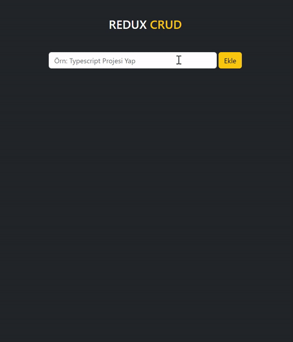

<h1> Redux Temel Kullanımı Projesi</h1>

Bu proje Redux'un temel kullanımını pekiştirmek amacıyla oluşturulmuş bir CRUD uygulamasını içermektedir. Proje React ve Redux teknolojilerini kullanmaktadır.

<h2> Proje Yapısı </h2>

<ul>
<li><b>src/actions/actionTypes.js:</b> Redux aksiyon tiplerini içerir.</li>
<li><b>src/actions/todoActions.js:</b> Todo işlemleri için Redux aksiyon yaratıcılarını içerir.</li>
<li><b>src/components/AddForm.jsx:</b> Yeni todo eklemek için kullanılan form bileşeni.</li>
<li><b>src/components/ListTodos.jsx:</b> Todo listesini gösteren bileşen.</li>
<li><b>src/components/Modal.jsx:</b> Todo düzenleme modalını içeren bileşen.</li>
<li><b>src/components/TodoCard.jsx:</b> Her bir todo öğesini gösteren bileşen.</li>
<li><b>src/reducers/todoReducer.js:</b> Todo işlemleri için Redux reducer'ını içerir.</li>
<li><b>src/reducers/userReducer.js:</b> Kullanıcı işlemleri için Redux reducer'ını içerir.</li>
<li><b>src/redux/store.js:</b> Redux store'unu oluşturan dosya.</li>
<li><b>src/App.jsx:</b> Ana uygulama bileşeni.</li>
<li><b>index.html:</b> HTML dosyası.</li>
<li><b>src/index.js:</b> Uygulamanın başlangıç noktası.</li>
</ul>

<h2> Redux Nedir?</h2>

Redux, JavaScript uygulamalarında durum yönetimi için kullanılan bir JavaScript kütüphanesidir. Redux özellikle büyük ve karmaşık uygulamalarda durumun daha öngörülebilir ve yönetilebilir olmasını sağlamak için tasarlanmıştır.

<ul>
<li><b>Tek Kaynakta Durum (Single Source of Truth):</b>Uygulama durumu (state) tüm uygulama için tek bir yerde (store) saklanır. Bu durum, uygulama boyunca birçok bileşen tarafından paylaşılır.</li>
<li><b>Durum Değişmezdir (State is Immutable): </b>Redux'ta durum değişmezdir. Yani, bir durumu güncellemek için mevcut durumu değiştirmek yerine yeni bir durum objesi oluşturulur.</li>
<li><b>Eylemler (Actions): </b>Durumu değiştirmek için kullanılan eylemler, uygulama içinde bir tür talimat veya veri paketidir.</li>
<li><b>Reducer'lar:</b>Reducer'lar, mevcut durumu ve bir eylemi alır, bu eyleme göre yeni bir durum objesi oluşturur ve bu yeni durumu döndürür.</li>
<li><b>Tek Yönlü Veri Akışı (Unidirectional Data Flow):</b>Redux'ta veri akışı bir yönlüdür. Eylemler, reducer'lar aracılığıyla durumu değiştirir ve bu durum değişikliği tüm bileşenlere otomatik olarak iletilir.</li>

</ul>

Redux özellikle büyük uygulamalarda durum yönetimini organize etmek ve hata ayıklamayı kolaylaştırmak için kullanılır. React ile sıkça birlikte kullanılsa da bağımsız olarak da kullanılabilir.

<h2>Kullanılan Teknolojiler </h2>
<ul>
<li>React</li>
<li>Redux</li>
<li>Bootstrap</li>
</ul>

Bu proje, Redux temel kullanımını anlamak ve pekiştirmek amacıyla oluşturulmuştur. Projeyi inceleyerek Redux ile nasıl aksiyonlar oluşturulup reducer'lar ile nasıl yönetildiğini görebilirsiniz.

<h2>Ekran Görüntüsü</h2>

